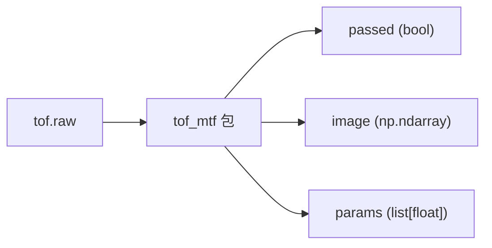

# tof_mtf

ToF 模组产测库。一次调用完成 **MTF 清晰度**、**模组姿态 (6 DoF)**、**光源 / 脏污** 三类产测，
返回总判定、可视化结果图，以及一组结构化数值。



---

## 跑起来

```bash
pip install opencv-python numpy pillow
python run.py tof.raw
```

会弹出一张 1600px 宽的拼接图：左侧 MTF + Tilt 子图，右侧产测项目面板（MTF 检测 / 姿态检测 / 脏污检测），右上角显示 OVERALL: PASS / FAIL。

---

## 在自己代码里调用

```python
from tof_mtf import run_all_checks

passed, image, params = run_all_checks("tof.raw")
# passed : bool
# image  : np.ndarray (H, W, 3)，可直接 cv2.imshow / cv2.imwrite
# params : list[float] 长度 9
#   [mtf_value, roll, pitch, yaw, tx, ty, tz, bright_top20_mean, dark_bottom20_mean]
```

* `tof.raw` 路径相对调用时的 cwd，绝对路径也可以。
* 包内的 `mtf.exe` / `config.ini` / `thresholds.json` 由包自己用 `__file__` 锚定，
  在任何 cwd 下 import 都能正确工作。
* 中间产物全部落到 `tof_mtf/tmp/`，不污染调用方目录。

---

## 调阈值

所有阈值集中在 `tof_mtf/thresholds.json`：

```json
{
  "mtf":   { "mtf_throat": 0.50 },
  "tilt":  { "angle_abs_deg_max": 10.0,
             "xy_abs_mm_max": 20.0,
             "z_mm_min": 380.0, "z_mm_max": 420.0 },
  "dirty": { "bright_top_mean_min": 80.0,
             "bright_top_mean_max": 240.0,
             "dark_bottom_mean_max": 30.0 }
}
```

改完直接重跑，不需要改代码。

---

## 检测原理

raw 是 ToF Sensor 的 30 × 40 × 64 直方图，包内先转成 30 × 40 灰度 pgm，再做三组检测。

* **MTF 检测** — 调包内 `mtf.exe` 跑斜边 MTF，解析其日志拆成 5 项：
  MTF 运行 / MTF 解析 / 过曝检测 / MTF 斜边数量 (≥ 2) / MTF 清晰度 (> mtf_throat)。
* **姿态检测** — 在 pgm 4 个象限提角点 → 亚像素精修 → 已知梯形尺寸 + 相机 HFOV 60°，
  `cv2.solvePnP(IPPE)` 反算 roll / pitch / yaw / tx / ty / tz，逐项与 `tilt` 阈值比对。
* **脏污检测** — 把 pgm 所有像素按亮度排序：
  最亮 20% 均值落在 `[bright_top_mean_min, bright_top_mean_max]`（光源亮度合规）；
  最暗 20% 均值 `≤ dark_bottom_mean_max`（暗区无脏污）。

`passed = MTF 全部通过 AND 姿态全部通过 AND 光源亮度通过 AND 脏污检测通过`。
